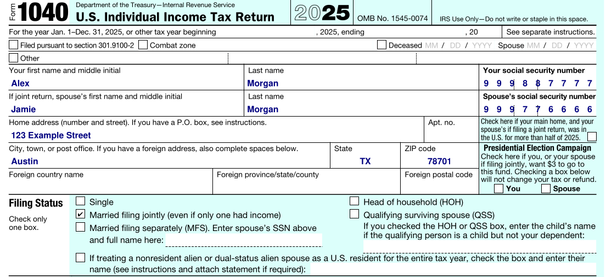
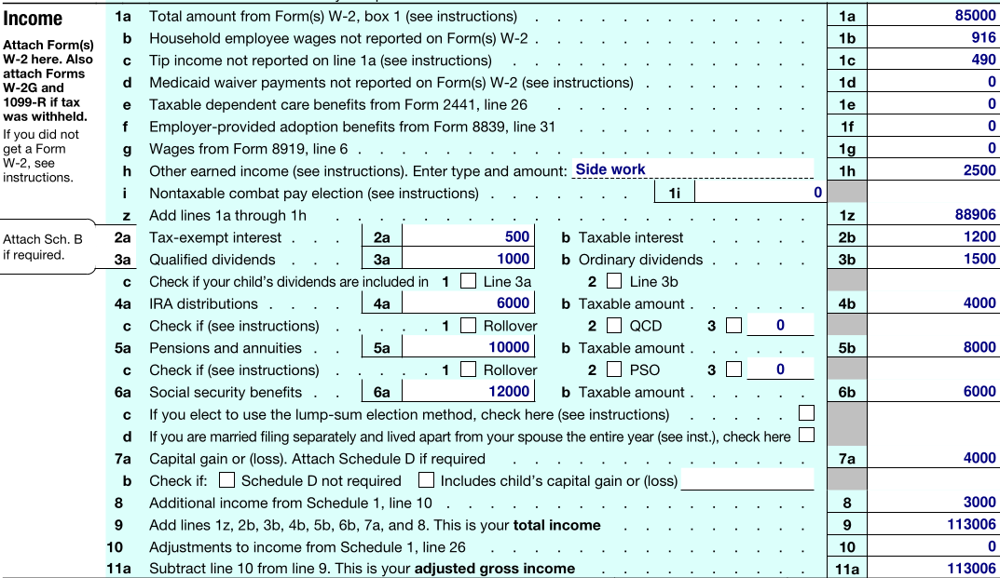

## What do we mean by 'Deterministic' ?

LLMs have advanced quite quickly from just a few years ago (remember all those people asking "how many R's in strawberry"?). From my own perspective I've seen these advancements first-hand, and I am routinely surprised with what LLMs are capable of. Agentic workflows have made it possible for LLMs to perform very complex tasks with virtually no human supervision as well.

However, what I want to talk about is closer to what I do in my day job. A lot of my work involves structured data extraction information from a heterogeneous mix of documents, and performing a variety of tasks on the extracted data in a reliable and **highly predictable** manner (emphasis on "highly predictable"). Integrating LLMs into production workflows can be challenging because, by nature, LLMs are NOT deterministic. Even with guardrails in place they can often show unusual behavior that needs to be caught and constrained to avoid breaking workflows. When you are processing tens of thousands of documents each month, unusual edge cases can start to show up regularly.

So when I say 'deterministic' I really mean offloading any work that an LLM doesn't necessarily need to do to a separate, predictible process. These can be things like:

-   Basic math
-   Date checking
-   Name parsing & matching
-   Case linkage

Delegating these tasks to a deterministic function shrinks the scope of the LLM, and reduces the number of elements that are at risk from unpredictable LLM behavior. If you're not aware of it, all the major LLM providers' chat platforms (ChatGPT, Gemini, Claude) have the ability to execute tool calls to do these sorts of calculations deterministically as well.

### An example: Some basic math

LLMs can definitely figure out math on their own. For example, I asked Qwen 3.8 to compute a fairly basic math problem: $(1356 * 40)^2$. Below is the (very lengthy) thinking trace that eventually gets it to the right answer:

<details>

``` text

what is (1356 \* 40)\^2

\[Start thinking\]

Okay, let's tackle this problem: (1356 \* 40)\^2. Hmm, first I need to figure out what 1356 multiplied by 40 is, and then square that result. Let me start by calculating the multiplication part.

So, 1356 times 40. Let me do that step by step. 1356 \* 40. Well, multiplying by 40 is the same as multiplying by 4 and then by 10. Let me compute 1356 \* 4 first.

1356 \* 4. Let's break it down: 1000*4 = 4000, 300*4=1200, 50*4=200, 6*4=24. Adding those up: 4000 + 1200 = 5200, plus 200 is 5400, plus 24 is 5424. So 1356 \* 4 = 5424. Then multiply by 10 to get 54240. So 1356 \* 40 = 54240.

Wait, let me double-check that. 1356 \* 40. Alternatively, 1356 \* 10 = 13560, then \*4 is 54240. Yes, that's the same. So that part is 54240.

Now, I need to square that number: 54240 squared. Let me compute 54240\^2. Hmm, squaring a number like this might be tedious. Let me see. Maybe I can write it as (5424 \* 10)\^2 = 5424\^2 \* 100. So first compute 5424 squared and then multiply by 100.

Calculating 5424\^2. Let me try to break it down. 5424 \* 5424. Let's use the method of (a + b)\^2 where a = 5400 and b = 24. Then (5400 + 24)\^2 = 5400\^2 + 2*5400*24 + 24\^2.

First, 5400\^2: 54\^2 = 2916, so 5400\^2 = 2916 \* 10000 = 29,160,000.

Next, 2*5400*24. Let's compute 5400*24 first. 5400*20 = 108,000 and 5400\*4 = 21,600. So total is 108,000 + 21,600 = 129,600. Then multiply by 2: 259,200.

Then 24\^2 = 576.

Adding all three parts: 29,160,000 + 259,200 + 576.

29,160,000 + 259,200 = 29,419,200. Then +576 = 29,419,776.

So 5424\^2 = 29,419,776. Then multiply by 100 (since we had 54240 = 5424*10, so squaring gives* 100). So total is 2,941,977,600.

Wait, let me verify that. 54240 squared. Let me check with another method to be sure. Maybe 54240 \* 54240.

Alternatively, 54240 \* 54240. Let's write it as:

54240 x54240 --------

But that's a bit tedious. Alternatively, note that 54240\^2 = (5424 \* 10)\^2 = 5424\^2 \* 100 = 29,419,776 \* 100 = 2,941,977,600. Yes, that seems right.

Wait, but let me check 5424 squared again. Let's verify 5424 \* 5424.

Let me compute 5424 \* 5424:

Break it down as (5000 + 424)\^2 = 5000\^2 + 2*5000*424 + 424\^2.

5000\^2 = 25,000,000.

2*5000*424 = 10,000 \* 424 = 4,240,000.

424\^2: Let's compute 424*424. 400\^2 = 160,000, 2*400\*24=19,200, 24\^2=576. So 160,000 + 19,200 = 179,200 + 576 = 179,776.

So total: 25,000,000 + 4,240,000 = 29,240,000 + 179,776 = 29,419,776. Yes, that matches the previous calculation. So 5424 squared is indeed 29,419,776. Multiply by 100 gives 2,941,977,600.

Therefore, (1356 \* 40)\^2 = 2,941,977,600.

Let me just check if I made any arithmetic errors. Let's recap:

1356 \* 40 = 54240. Correct.

54240 squared: 5424\^2 \* 100. 5424 squared is 29,419,776. Multiply by 100: 2,941,977,600. Yes.

I think that's correct. \[End thinking\]

(1356 \* 40)\^2 = 2,941,977,600
```

</details>

However, we can do the exact same work by just sending it directly to python:

``` python
>>> (1356 * 40)**2
2941977600
```

The distinction I'm making here is that the first one is correct, but always subject to some degree of error, while the second is faster and entirely predictable. When building workflows with LLMs, anything that can be computed with a high degree of certainty should be done separately from an LLM call.

## Extraction Objects

Let's walk through a more realistic example. Say you were developing an extraction workflow to analyze 1040 tax returns and you had the following tasks you wanted to complete:

1.  Extract the names of the primary filer and spouse
2.  Validate that if a spouse is present, that they are 'Married Filing Jointly' or 'Seperately'.
3.  Compute all of the extra income from sections `1b` to `1i`

The relevant top-level section is here:



And the income bit is here:



Implementing the deterministic bit is an open-ended question for the developer. There are a lot of different ways you can do this. For instance:

1.  Implement tool calls and instruct the LLM to use them for specific tasks.
2.  Build python post-processing functions to work in intermediate steps in the LLM flow, or directly after the final result.
3.  Do #2, but integrate them directly into a pydantic workflow via [computed fields](https://pydantic.dev/docs/validation/2.3/usage/computed_fields/).

Because I tend to use pydantic quite a bit for extraction work, I'll show an example using #3. Computed fields in pydantic are really no different than embedding python functions into the validation schema, which then can get called automatically on validation, or on-demand using a normal class function call.

Below is my entire workflow using a local model, [NuExtract3](https://gmcirco.github.io/blog/posts/mini-model-ocr-vision/workflow.html), as the LLM. I wont cite the code line-by-line, but the big pieces are that I define a `TaxForm` extraction object, which inherits specific extraction fields like a single income line `IncomeObject` or a checklist for filing status `FilingStatusObject`. I then just convert the pydantic schema to one tuned for NuExtract3 using the `Numind`

<details>

``` python
import base64
import json
from pydantic import BaseModel, Field, computed_field
from io import BytesIO
from pdf2image import convert_from_path  # type: ignore
from openai import OpenAI
from numind.nuextract_utils import convert_json_schema_to_nuextract_template  # type: ignore

client = OpenAI(base_url="http://127.0.0.1:8080")


class IncomeObject(BaseModel):
    name: str 
    line_number: str 
    value: float 


class FilerObject(BaseModel):
    first_name: str 
    last_name: str 
    ssn: str 

class FilingStatusObject(BaseModel):
    single: bool 
    married_filing_jointly: bool
    married_filing_separately: bool
    head_of_household: bool 
    qualifying_surviving_spouse: bool

class TaxForm(BaseModel):
    PrimaryFiler: FilerObject
    SpouseFiler: FilerObject 
    FilingStatus: FilingStatusObject 
    Income: list[IncomeObject] 

    _AD_LINES = {"1b", "1c", "1d", "1e", "1f", "1g", "1h", "1i"}
    _SPOUSE_REQUIRED_STATUSES = {"married_filing_jointly", "married_filing_separately"}

    @computed_field
    @property
    def total_addtl_wages(self) -> float:
        """Sum of additional income line items that comprises income element z.
        Includes: 1b, 1c, 1d, 1e, 1f, 1g, 1h, 1i
        """
        return sum(
            item.value for item in self.Income if item.line_number in self._AD_LINES
        )

    @computed_field
    @property
    def has_spouse(self) -> bool:
        return bool(self.SpouseFiler.first_name and self.SpouseFiler.last_name)

    @computed_field
    @property
    def filing_status_checklist(self) -> dict[str, bool | list[str]]:
        """Validates the filing status checkboxes against spouse presence.

        Returns which statuses are marked, whether the marked set is valid,
        and any issues found (none marked, multiple marked, or a spouse-required
        status missing when a spouse is present).
        """
        marked = [
            name for name, checked in self.FilingStatus.model_dump().items() if checked
        ]

        issues = []
        if len(marked) == 0:
            issues.append("no_status_marked")
        elif len(marked) > 1:
            issues.append("multiple_statuses_marked")

        if self.has_spouse and not (self._SPOUSE_REQUIRED_STATUSES & set(marked)):
            issues.append("spouse_present_but_no_married_status_marked")

        if not self.has_spouse and (self._SPOUSE_REQUIRED_STATUSES & set(marked)):
            issues.append("married_status_marked_but_no_spouse_present")

        return {
            "marked": marked,
            "valid": len(issues) == 0,
            "issues": issues,
        }

# Convert from pydantic to numind extraction
# check for any fields that don't get parsed correctly
result = convert_json_schema_to_nuextract_template(TaxForm.model_json_schema())
template = result["template"]
incompatibilities = result["incompatibilities"]

if result["schema_status"] != "fully_converted":
    print("Warning: schema not fully converted:", result["schema_status"])
if incompatibilities:
    print("Incompatibilities (expected for computed fields):", incompatibilities)


file = "/img_test_document_2.pdf"


def pdf_page_to_base64(pdf_path: str, page_number: int = 0, dpi: int = 200) -> str:
    """Convert a single PDF page to a base64-encoded JPEG."""
    images = convert_from_path(
        pdf_path, dpi=dpi, first_page=page_number + 1, last_page=page_number + 1
    )
    img = images[0].convert("RGB")
    buffer = BytesIO()
    img.save(buffer, format="JPEG", quality=90)
    return base64.b64encode(buffer.getvalue()).decode("utf-8")


image_b64 = pdf_page_to_base64(file, page_number=0, dpi=200)

completion = client.chat.completions.create(
    model="local-model",
    temperature=0.6,
    messages=[
        {
            "role": "user",
            "content": [
                {
                    "type": "image_url",
                    "image_url": {"url": f"data:image/jpeg;base64,{image_b64}"},
                },
            ],
        }
    ],
    extra_body={
        "chat_template_kwargs": {
            "template": json.dumps(template),
            "instructions": "Extract the line number as string like: '1a', '2b'. Extract 'Name' as the full name of the line item.'",
            "enable_thinking": True,
        }
    },
)
```

</details>

Looking at just the raw extraction, we get the following result below. We obtain all the correct information on the primary filer, the spouse, the checklist for filing status, and the full list of income extractions with the line items.

<details>

``` json
{
    "PrimaryFiler": {
        "first_name": "Alex",
        "last_name": "Morgan",
        "ssn": "999887777"
    },
    "SpouseFiler": {
        "first_name": "Jamie",
        "last_name": "Morgan",
        "ssn": "999776666"
    },
    "FilingStatus": {
        "single": false,
        "married_filing_jointly": true,
        "married_filing_separately": false,
        "head_of_household": false,
        "qualifying_surviving_spouse": false
    },
    "Income": [
        {
            "name": "Total amount from Form(s) W-2, box 1",
            "line_number": "1a",
            "value": 85000
        },
        {
            "name": "Household employee wages not reported on Form(s) W-2",
            "line_number": "1b",
            "value": 916
        },
        {
            "name": "Tip income not reported on line 1a",
            "line_number": "1c",
            "value": 490
        },
        {
            "name": "Medicaid waiver payments not reported on Form(s) W-2",
            "line_number": "1d",
            "value": 0
        },
        {
            "name": "Taxable dependent care benefits from Form 2441, line 26",
            "line_number": "1e",
            "value": 0
        },
        {
            "name": "Employer-provided adoption benefits from Form 8839, line 31",
            "line_number": "1f",
            "value": 0
        },
        {
            "name": "Wages from Form 8919, line 6",
            "line_number": "1g",
            "value": 0
        },
        {
            "name": "Other earned income (see instructions). Enter type and amount:",
            "line_number": "1h",
            "value": 2500
        },
        {
            "name": "Add lines 1a through 1h",
            "line_number": "1z",
            "value": 88906
        },
        {
            "name": "Tax-exempt interest",
            "line_number": "2a",
            "value": 500
        },
        {
            "name": "Taxable interest",
            "line_number": "2b",
            "value": 1200
        },
        {
            "name": "Qualified dividends",
            "line_number": "3a",
            "value": 1000
        },
        {
            "name": "Ordinary dividends",
            "line_number": "3b",
            "value": 1500
        },
        {
            "name": "IRA distributions",
            "line_number": "4a",
            "value": 6000
        },
        {
            "name": "Taxable amount",
            "line_number": "4b",
            "value": 4000
        },
        {
            "name": "Pensions and annuities",
            "line_number": "5a",
            "value": 10000
        },
        {
            "name": "Taxable amount",
            "line_number": "5b",
            "value": 8000
        },
        {
            "name": "Social security benefits",
            "line_number": "6a",
            "value": 12000
        },
        {
            "name": "Taxable amount",
            "line_number": "6b",
            "value": 6000
        },
        {
            "name": "Capital gain or (loss)",
            "line_number": "7a",
            "value": 4000
        },
        {
            "name": "Additional income from Schedule 1, line 10",
            "line_number": "8",
            "value": 3000
        },
        {
            "name": "Add lines 1z, 2b, 3b, 4b, 5b, 6b, 7a, and 8. This is your total income",
            "line_number": "9",
            "value": 113006
        },
        {
            "name": "Adjustments to income from Schedule 1, line 26",
            "line_number": "10",
            "value": 0
        },
        {
            "name": "Subtract line 10 from line 9. This is your adjusted gross income",
            "line_number": "11a",
            "value": 113006
        }
    ]
}
```

</details>

In the `TaxForm` pydantic class we have our computed fields. For example, this one takes the sum of all the extracted values from the additional income section, and sums them:

``` python

@computed_field
@property
def total_addtl_wages(self) -> float:
    """Sum of additional income line items that comprises income element z.
    Includes: 1b, 1c, 1d, 1e, 1f, 1g, 1h, 1i
    """
    return sum(
        item.value for item in self.Income if item.line_number in self._AD_LINES
    )
```

For all these computed elements, we can extract them directly from the schema like:

``` python
# unpack and validate the LLM content
result = json.loads(completion.choices[0].message.content)
TaxForm.model_validate(result)
tax_form = TaxForm(**result)

# export the computed fields
print(f"Total Additional Wages: {tax_form.total_addtl_wages}")
print(f"Has Spouse: {tax_form.has_spouse}")
print(f"Filing Status Checklist: {tax_form.filing_status_checklist}")
```

Which will give us the following:

``` text
Total Additional Wages: 3906.0
Has Spouse: True
Filing Status Checklist: {'marked': ['married_filing_jointly'], 'valid': True, 'issues': []}
```

In a production workflow, I would probably then take these elements, along with the extracted ones, and build a final payload response object that would be ingested somewhere else downstream in the system. But what we can see here is that it is quite easy to build in post-processing workflows into an LLM-based process to ensure extraction results are reliable.