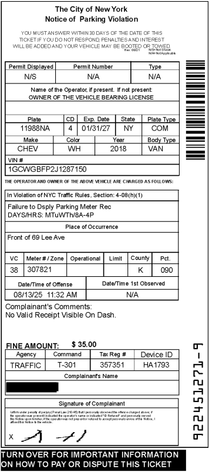

## More Small LLMs ?

For this post, I'm using another small model called [NuExtract3](https://huggingface.co/numind/NuExtract3). This model is actually just a fine-tuned version of a [Qwen3.5-4B](https://huggingface.co/Qwen/Qwen3.5-4B-Base) model, which I had [previously run](https://gmcirco.github.io/blog/posts/mini-model-data-extraction/workflow.html) locally on my own machine before. I've already spoken quite a bit about the smaller Qwen and Gemma models, and how they have a lot of utility for well-defined, targeted tasks. Because they have a small footprint and don't require a lot of VRAM, they are easy to deploy in a low cost-environment.

Let's get down to brass tacks. What got me specifically interested in NuExtract is that it covers a use-case that I run across a lot in my day job: document processing. We are often asked to process documents in a variety of ways - including extraction of information, validating fields on the document, and performing more complex tasks (like classification). We typically use vision LLMs with structured prompts and tools to perform these tasks. However, cost is always a concern. While a single, 2-3 page document might not cost much to process (likely in the range of less than 1 cent), when you multiply this across hundreds of thousands of documents, the dollars start to add up. It is typically prudent to start with the smallest viable model you can, and work up from there. In many cases, the tasks are simple enough that you don't need a bleeding-edge model to process it!

## The Data

Let's illustrate a simple scenario here: extracting information from parking tickets. For this example I rely on NYC Open Data's collection of m[oving violations and tickets](https://data.cityofnewyork.us/City-Government/Open-Parking-and-Camera-Violations/nc67-uf89/about_data). This set of data contains a number of structured fields in a tabular format about the violation (plate number, issue date, etc...). However, they also include a field named `summons_image` which is a url link to an image of the ticket. These image copies look like this:



This is a good example for testing because we have an image with a mixture of different field types, as well as some ground truth defined in the dataframe.

My goal is to set up a small model and extract values off of these tickets. While many of the fields are relatively straightforward, like plate number or date of incident, some other fields are more ambiguous. For example, the summons number is an unlabeled vertical number in the bottom right-hand corner. Getting the LLM to reliably extract this will require some extra work.

## Running the Model

### Setting up the local LLM

For my local setup I use a [4-bit quantized](https://huggingface.co/numind/NuExtract3-GGUF) version of the base model. This involves downloading both the `.gguf` file and the vision component. I deploy this model the same way as I have before, using llama.cpp and exposing a local endpoint via `llama-server`. One unique element of NuExtract is that it is tuned for a specific JSON extraction schema using their own [named types](https://huggingface.co/numind/NuExtract3/blob/main/TYPES.md). All this means is when we invoke the model, we should pass a [schema object](https://huggingface.co/numind/NuExtract3#structured-extraction-1) to the model along with any ancillary instructions, and conform to the expected schema rules. While we could certainly run the model using a different schema (it is, after all, just a fine-tuned base model) it is likely to degrade performance if we diverge from the fine-tuned expectations.

I typically structure extraction rules as Pydantic schemas, because it helps formalize and standardize extraction rules, as well as making it easier for me to validate the output. Luckily, NuExtract has a helper function that converts Pydantic schema directly to their own expected style:

``` python
from pydantic import Field, BaseModel
from numind.nuextract_utils import convert_json_schema_to_nuextract_template

class TicketExtract(BaseModel):
    date: str = Field(description="date")
    time: str = Field(description="time")
    car_make: str
    car_body_type: str
    car_color: str
    summons_number: str
    violation_code: str
    location: str
    license_plate: str
    fine_amount: float
    comments: str


template, _ = convert_json_schema_to_nuextract_template(
    TicketExtract.model_json_schema()
)
```

The actual template is then converted to the following below, which is passed directly to the model as its extraction schema. 

``` python
{'date': 'date',
 'time': 'time',
 'car_make': 'string',
 'car_body_type': 'string',
 'car_color': 'string',
 'summons_number': 'string',
 'violation_code': 'string',
 'location': 'string',
 'license_plate': 'string',
 'fine_amount': 'number',
 'comments': 'string'}

```

### Extraction code

There are only a few tasks we have to do to run this code. First, since the objects we're processing are pdfs, we need to convert them to image bytes object and pass those to the model. I have a few helper functions that do this via `pdf2image`.

<details>
``` python
def pdf_page_to_base64(pdf_path: str, page_number: int = 0, dpi: int = 200) -> str:
    """Convert a single PDF page to a base64-encoded JPEG."""
    images = convert_from_path(
        pdf_path, dpi=dpi, first_page=page_number + 1, last_page=page_number + 1
    )
    img = images[0].convert("RGB")
    from io import BytesIO

    buffer = BytesIO()
    img.save(buffer, format="JPEG", quality=90)
    return base64.b64encode(buffer.getvalue()).decode("utf-8")
```
</details>

Structuring the actual invocation just involves passing a base64 bytes image of the .pdf and dumping the JSON extraction template directly into the prompt. Following the convention of the authors, we also pass a short instruction to the model to let it know that the summons number is the series of digits in the bottom-right corner of the ticket. You'll notice the prompt we're passing is *extremely* minimal. It is essentially just a few named fields, the expected value (e.g. date, string), and a short optional instruction about the summons number.

<details>
``` python
def extract_from_pdf(
    pdf_path: str,
    start_page: int = 0,
    max_pages: int | None = None,
) -> list[dict]:
    """Extract structured data from pages of a PDF.

    Args:
        pdf_path:   Path to the PDF file.
        start_page: Zero-based index of the first page to process.
        max_pages:  Maximum number of pages to process. None = all remaining pages.
    """
    total_pages = pdfinfo_from_path(pdf_path)["Pages"]
    end_page = min(start_page + max_pages, total_pages) if max_pages else total_pages

    results = []
    for page_num in range(start_page, end_page):
        print(f"Processing page {page_num + 1}/{end_page}...")
        image_b64 = pdf_page_to_base64(pdf_path, page_number=page_num, dpi=200)
        completion = client.chat.completions.create(
            model="local-model",
            temperature=0.2,
            messages=[
                {
                    "role": "user",
                    "content": [
                        {
                            "type": "image_url",
                            "image_url": {"url": f"data:image/jpeg;base64,{image_b64}"},
                        },
                    ],
                }
            ],
            extra_body={
                "chat_template_kwargs": {
                    "template": json.dumps(template),
                    "instructions": "Summons number is a 10-digit number printed vertically in the bottom-right corner of the ticket.",
                    "enable_thinking": False,
                }
            },
        )
        results.append(
            {"page": page_num + 1, "extracted": completion.choices[0].message.content}
        )
    return results
```
</details>

After running it, we store the results in a JSON structure which looks like this. We can quickly validate against the ground-truth data in the table that these were all extracted correctly. In fact, in the 10 examples I ran, I observed no errors at all. Overall, quite impressive for a small model with a highly minimal extraction prompt.

``` json
{
    "file": "ticket_002.pdf",
    "page": 1,
    "extracted": {
        "date": "2025-08-13",
        "time": "11:32:00",
        "car_make": "CHEV",
        "car_body_type": "VAN",
        "car_color": "WH",
        "summons_number": "9224512719",
        "violation_code": "4-08(h)(1)",
        "location": "Front of 69 Lee Ave",
        "license_plate": "11988NA",
        "fine_amount": 35.0,
        "comments": "No Valid Receipt Visible On Dash."
    }
}
```

My thoughts for this, is that it is a promising model for straightforward OCR-esque data extraction. Tools like Tesseract, in my experience, are often a bit harder to configure and are slightly less reliable when the structure of the document changes. While I haven't pressure-tested this model on more complex extraction tasks, I think this illustrates some of the utility of small LLMs - especially considering the increasing costs of models.